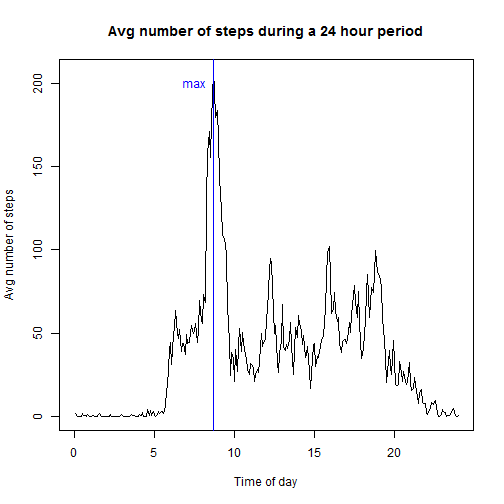

## Loading and preprocessing the data

Loading the data is rather simple. Preprocessing will be explained under each heading, usually as comments in the code itself. For each subsection of the assignment I choose different methods of preprocessing. I did this to gain insight into different ways of doing the same thing. Some used the dplyr package, others simply used no packages. To load the data set and corresponding libraries:


```r
library(dplyr)
library(lubridate)
library(ggplot2)

activity <- read.csv("activity.csv", header=TRUE, sep=",")
```


## What is mean total number of steps taken per day?

The total number of steps taken per day is coded below. In this code the NA values were not removed. They will be removed later in the assignment, and a clear difference can be seen between the mean and median values once the NA's are removed. The code is pretty simple, it loops over the 2 months, one day at a time (or 288 elements (288*5 min = 1440 min. 1440min/60min/hour = 24 hours)) and sums the total number of steps. The mean value is 9354 steps, while the median is 10395 steps. It is important to remember this is before the NA's have been removed.


```r
activity$date_lub <- ymd(activity$date)                              #will be used to set dates and time


activity_sum_vector <- vector(mode="numeric", length=0)              #Make empty vectors for appending
date_lub_vector <- vector(mode="numeric", length=0)
i <- 0

for (i in 0:60){                                                     #loop 61 times, one for each day
        A <- i*288+1                                                 #A,B set the range to sum over (1440) min = 1 day
        B <- A+287
        activity_day <- activity[A:B,]                               #select columns for one day
        activity_sum <- sum(na.omit(activity_day$steps))             #sum the number of steps for one day
        activity_sum_vector <- append(activity_sum_vector, activity_sum, after=length(activity_sum_vector)) 
        #make a vector of summed steps for each day. Will be a vector of length 61
        
        date_lub_vector <- append(date_lub_vector, activity[B,4], after=length(date_lub_vector))
        #make another vectorof length 61 with the date. Will incorporate time in here later
}


sum_steps_per_day <- data.frame(date_lub_vector, activity_sum_vector)     #make a df with sum steps per day and date
median_sum <- median(sum_steps_per_day$activity_sum_vector)               #find the median number of steps over the 61 days
mean_sum <- mean(sum_steps_per_day$activity_sum_vector)                   #find the mean number of steps over the 61 days

#png(width=480, height=480, units="px", file='plot1.png', bg = "transparent") #save plot
hist(sum_steps_per_day$activity_sum_vector, breaks=25,
     main = "Number of steps taken per day",
     xlab="Steps per day",
     xlim=c(0,25000)
     )                                                                    #make a histogram of number of steps
abline(v=median_sum,col="red", lwd=3)                                     #add a median line colored red
abline(v=mean_sum,col="blue", lwd=3)                                      #add a mean line colored blue
text(x=7500,y=10, label="mean", col="blue")                               #add text labeling to abline
text(x=13000,y=10, label="median", col="red")                             #add text labeling to abline
```

 

```r
#dev.off()
```


## What is the average daily activity pattern?

For the average, I choose to look at the mean number of steps across a 24 hour period. This is the same thing as saying there are 288 five min periods in a day. That is, a total of 288 entries multiplied by 5 min equals 1440 min, or the total number of minutes in a day. 1440 min divided by 60 min (in an hour) is 24 hours. I prefered to look at this question in terms of time of day instead of minute increment to gain insight into how the user spent their day. It appears this person lives in a city as their highest number of steps are all peaked slightly before 9am, or the start of the work day for many people. The max value of steps (206 steps) happens at minute 520, or 8:40 am. The next isolated peak is around lunch time. The other interesting thing is that if you integrate from 8am-9:40am you can get the a rough estimate of the total number of steps the User takes to get to work. Since there is no dip (i.e. steps that go to almost zero in that 5-min time frame) we know the user does not take public transportation. If they did, we might (by looking at city transport time tables) be able to tell what city the User lives in. What we can tell; about how far the User lives from work, i.e. distance from work = total number of steps from 8am to 9:40am * average distance a person takes per step. Creepy.


```r
activity_min <- vector(mode="numeric", length=0)                           #make empty vectors for appending
activity_steps_vector <- vector(mode="numeric", length=0)


i <- 0                                                                    #all this loop does is make a vector which formats 
for (i in 0:60){                                                          #the time in a more readable way. It basically
        A <- i*288+1                                                      #makes each day have values 1:288
        B <- A+287
                
        activity_min <- append(activity_min, (0:287), after=length(activity_min)) 
       
}


activity$time <- activity_min*5                                         #multiply by 5 and you have a readable time column

j<-0                                                                    #loop 288 times, for each 5 min interval in a day
for (j in 0:287){
        steps_given_day_min <- filter(activity, time==j*5)              #only grab rows with the correct 5 min time interval
        mean_steps_min <- mean(steps_given_day_min$steps, na.rm=TRUE)   #calculate the average of the 5min interval with
                                                                        #NA's removed
        activity_steps_vector <- append(activity_steps_vector, mean_steps_min, after=length(activity_steps_vector))
                                                                        #make a vector of these averages
}

mean_steps_in_a_day <- data.frame(c(1:288)*5/60, activity_steps_vector) #create a data frame with time in hours from
                                                                        #a 24 hr clock and avg # of steps over that time
colnames(mean_steps_in_a_day) <- c("time","steps")                      #label the columns

max_steps <- filter(mean_steps_in_a_day, steps >206)

#png(width=480, height=480, units="px", file='plot2.png', bg = "transparent") #save plot dev.off()
plot(mean_steps_in_a_day$time, mean_steps_in_a_day$steps, type="l",
     main = "Avg number of steps during a 24 hour period",
     xlab="Time of day",
     ylab="Avg number of steps",
     xlim=c(0,24)
     )
#abline(v=8,col="blue", lwd=1)  
abline(v=8.67,col="blue", lwd=1)             #add a mean line colored blue
text(x=7.5,y=200, label="max", col="blue")
```

 

```r
#dev.off()
```

## Imputing missing values

Removing NA's for the value of the number of steps averaged over the two months, you see that the mean and median are the same value at 10766.2 steps per day. This makes sense if you think about it. Remember, many of the days are not accounted for. So for every day where data is not taken, those days just get the mean number of steps inserted into them.

Now, if you are then smart and remove all days with steps value of 10766,(full days with NA, most likely a dead battery) ie make make a 'somedf <- filter(sum_steps_per_day, activity_sum_vector < 10766 | activity_sum_vector > 10767)' you will see a slightly different histogram. Now the mean is 10766.2 (not surprising) with a median of 10765.


```r
library(dplyr)                                                                 
library(lubridate)
library(ggplot2)


activity <- read.csv("activity.csv", header=TRUE, sep=",")                        #read in activity csv


activity_min <- vector(mode="numeric", length=0)                                  #set vectors to empty for append
activity_steps_vector <- vector(mode="numeric", length=0)


i <- 0                                                    #loop makes a vector from 1:288 for each day
for (i in 0:60){
        A <- i*288+1
        B <- A+287
                
        activity_min <- append(activity_min, (0:287), after=length(activity_min)) 
       
}


activity$time <- activity_min*5       #make a column that for each day there are 0-1440 min in 5-min intervals          


#******************************************************************************************************************

#This loop finds all instances of a 5-min interval for the two month data set and averages them
#NA's are omitted.

j<-0
for (j in 0:287){
        steps_given_day_min <- filter(activity, time==j*5)
        mean_steps_min <- mean(steps_given_day_min$steps, na.rm=TRUE)
        activity_steps_vector <- append(activity_steps_vector, mean_steps_min, after=length(activity_steps_vector))
        
}

mean_steps_in_a_day <- data.frame(c(0:287)*5, activity_steps_vector)
colnames(mean_steps_in_a_day) <- c("time","steps")

#make a df with the time in 5-min intervals spaced by 5-1440, with the mean number of steps in during that interval


#*******************************************************************************************************************

#Replace the NA step values (for a given 5-min interval) with the mean number of steps during that 5-min interval.

k <- 1
for (k in 1:length(activity[,1])){
      if (is.na(activity[k,1])==TRUE){
                activity_time_value <- activity[k,4]
                mean_steps_replace_df <- filter(mean_steps_in_a_day, time==activity_time_value)
                mean_steps_replace_value <- mean_steps_replace_df$steps
                activity[k,1] <- mean_steps_replace_value
        
      }  
    
}


#*****************************************************************************************************************

activity_sum_vector <- vector(mode="numeric", length=0)

i <- 0

for (i in 0:60){
  A <- i*288+1
  B <- A+287
  activity_day <- activity[A:B,]
  activity_sum <- sum(na.omit(activity_day$steps))
  activity_sum_vector <- append(activity_sum_vector, activity_sum, after=length(activity_sum_vector))
  
  
  

}


median_sum <- median(activity_sum_vector)  
mean_sum <- mean(activity_sum_vector)  

#png(width=480, height=480, units="px", file='plot3.png', bg = "transparent") #save plot dev.off()
hist(activity_sum_vector, breaks=25,
     main = "Number of steps taken per day",
     xlab="Steps per day",
     xlim=c(0,25000),
     ylim=c(0,20)
     )
abline(v=median_sum,col="red", lwd=5)
abline(v=mean_sum,col="blue", lwd=3)                                   
text(x=19000,y=12, label="Notice large frequency right at", col="blue", cex=.8)
text(x=19200,y=10, label="mean number of steps per day", col="blue", cex=.8)
```

 

```r
#dev.off()     


sum_steps_per_day <- data.frame(date_lub_vector, activity_sum_vector)
somedf <- filter(sum_steps_per_day, activity_sum_vector < 10766 | activity_sum_vector > 10767)

#png(width=480, height=480, units="px", file='plot4.png', bg = "transparent") #save plot dev.off()
hist(somedf$activity_sum_vector, breaks=25,
     main = "Number of steps taken per day",
     xlab="Steps per day",
     xlim=c(0,25000),
     ylim=c(0,20)
     )
abline(v=median_sum,col="red", lwd=5)
abline(v=mean_sum,col="blue", lwd=3)
text(x=19000,y=12, label="Now notice a smaller frequency at", col="blue", cex=.8)
text(x=19200,y=10, label="mean number of steps per day", col="blue", cex=.8)
```

 

```r
#dev.off()
#
```


Finally, there is one more way to look at the data. Remember we replaced the NA's with the average number of steps taken in that 5-min interval over the 61 days. But, if you look at activity, there are entire days where the number of steps is zero. This is most likely because the user did not wear his device. I know this, because I frequently forget to put on my fitbit, especially after charging it. So for fun, I also replaced all zero value 5-min intervals with their average number of steps and plotted the histogram. Doing this is straightfoward, as we change the conditional statement from


```r
if (is.na(activity[k,1])==TRUE)
```

to have an "or" statement


```r
if (is.na(activity[k,1])==TRUE | activity[k,1]==0)
```


The resulting histogram is plotted below (with 10766 steps removed, i.e. full NA days)


```r
library(dplyr)                                                                 
library(lubridate)
library(ggplot2)


activity <- read.csv("activity.csv", header=TRUE, sep=",")                        #read in activity csv


activity_min <- vector(mode="numeric", length=0)                                  #set vectors to empty for append
activity_steps_vector <- vector(mode="numeric", length=0)


i <- 0                                                    #loop makes a vector from 1:288 for each day
for (i in 0:60){
        A <- i*288+1
        B <- A+287
                
        activity_min <- append(activity_min, (0:287), after=length(activity_min)) 
       
}


activity$time <- activity_min*5       #make a column that for each day there are 0-1440 min in 5-min intervals          


#******************************************************************************************************************

#This loop finds all instances of a 5-min interval for the two month data set and averages them
#NA's are omitted.

j<-0
for (j in 0:287){
        steps_given_day_min <- filter(activity, time==j*5)
        mean_steps_min <- mean(steps_given_day_min$steps, na.rm=TRUE)
        activity_steps_vector <- append(activity_steps_vector, mean_steps_min, after=length(activity_steps_vector))
        
}

mean_steps_in_a_day <- data.frame(c(0:287)*5, activity_steps_vector)
colnames(mean_steps_in_a_day) <- c("time","steps")

#make a df with the time in 5-min intervals spaced by 5-1440, with the mean number of steps in during that interval


#*******************************************************************************************************************

#Replace the NA step values (for a given 5-min interval) with the mean number of steps during that 5-min interval.

k <- 1
for (k in 1:length(activity[,1])){
      if (is.na(activity[k,1])==TRUE | activity[k,1]==0){
                activity_time_value <- activity[k,4]
                mean_steps_replace_df <- filter(mean_steps_in_a_day, time==activity_time_value)
                mean_steps_replace_value <- mean_steps_replace_df$steps
                activity[k,1] <- mean_steps_replace_value
        
      }  
    
}


#*****************************************************************************************************************

activity_sum_vector <- vector(mode="numeric", length=0)

i <- 0

for (i in 0:60){
  A <- i*288+1
  B <- A+287
  activity_day <- activity[A:B,]
  activity_sum <- sum(na.omit(activity_day$steps))
  activity_sum_vector <- append(activity_sum_vector, activity_sum, after=length(activity_sum_vector))
  
  
  

}


median_sum <- median(activity_sum_vector)  
mean_sum <- mean(activity_sum_vector)  

sum_steps_per_day <- data.frame(date_lub_vector, activity_sum_vector)
somedf <- filter(sum_steps_per_day, activity_sum_vector < 10766 | activity_sum_vector > 10767)

#png(width=480, height=480, units="px", file='plot5.png', bg = "transparent") #save plot dev.off()
hist(somedf$activity_sum_vector, breaks=25,
     main = "Number of steps taken per day",
     xlab="Steps per day",
     xlim=c(10000,30000),
     ylim=c(0,10)
     )
abline(v=median_sum,col="red", lwd=5)
abline(v=mean_sum,col="blue", lwd=3)
```

 

```r
#dev.off()

#
```

## Are there differences in activity patterns between weekdays and weekends?

A lot of this code is redudant from the above code, but I tweaked a few things for fun (at the expense of making the code simpler). I'm still new to R and right now care more about understanding how R works than I am stream-lining code efficiency. Hopefully that will soon change. I also included an additional plot to help gain insight into the weekend verse weekday walking patterns. The first plot shows the total number of steps per day over the course of the two months. There are then two points (blue = saturday, red=sunday). You can see in terms of total distance travelled there is not much difference between weekends and weekdays.

The second plot (the one required by the assignment) confirms the results of the first plot. A few things to notice is that while our User doesn't sleep in any later, they do sit around much longer. Also they are less active after 8pm. Finally the User walks about 15% more on the weekends than the weekdays. Just type (sum(weekends_steps$steps) / sum(weekdays_steps$steps)) into the console to see this.

```r
library(dplyr)
library(lubridate)
library(ggplot2)


activity <- read.csv("activity.csv", header=TRUE, sep=",")


activity_min <- vector(mode="numeric", length=0)
activity_steps_vector <- vector(mode="numeric", length=0)


i <- 0
for (i in 0:60){
  A <- i*288+1
  B <- A+287
  
  activity_min <- append(activity_min, (0:287), after=length(activity_min)) 
  
}


activity$time <- activity_min*5


#******************************************************************************************************************


j<-0
for (j in 0:287){
  steps_given_day_min <- filter(activity, time==j*5)
  mean_steps_min <- mean(steps_given_day_min$steps, na.rm=TRUE)
  activity_steps_vector <- append(activity_steps_vector, mean_steps_min, after=length(activity_steps_vector))
  
}

mean_steps_in_a_day <- data.frame(c(0:287)*5, activity_steps_vector)
colnames(mean_steps_in_a_day) <- c("time","steps")

#plot(mean_steps_in_a_day$time, mean_steps_in_a_day$steps, type="l")


#*******************************************************************************************************************

k <- 1
for (k in 1:length(activity[,1])){
  if (is.na(activity[k,1])==TRUE){
    activity_time_value <- activity[k,4]
    mean_steps_replace_df <- filter(mean_steps_in_a_day, time==activity_time_value)
    mean_steps_replace_value <- mean_steps_replace_df$steps
    activity[k,1] <- mean_steps_replace_value
    
  }  
  
}


#*****************************************************************************************************************

activity_sum_vector <- vector(mode="numeric", length=0)
date_lub_vector <- vector(mode="numeric", length=0)
i <- 0

for (i in 0:60){
  A <- i*288+1
  B <- A+287
  activity_day <- activity[A:B,]
  activity_sum <- sum(na.omit(activity_day$steps))
  activity_sum_vector <- append(activity_sum_vector, activity_sum, after=length(activity_sum_vector))
  
  
  date_lub_vector <- append(date_lub_vector, ymd(activity[B,2]), after=length(date_lub_vector))
  
}


sum_steps_per_day <- data.frame(date_lub_vector, activity_sum_vector)

saturday <- filter(sum_steps_per_day, wday(sum_steps_per_day$date_lub_vector)==6)
sunday <- filter(sum_steps_per_day, wday(sum_steps_per_day$date_lub_vector)==7)

#png(width=480, height=480, units="px", file='plot6.png', bg = "transparent") #save plot dev.off()
plot(sum_steps_per_day$date_lub_vector, sum_steps_per_day$activity_sum_vector, type="l",
     ylab = "total number of steps taken",
     xlab="Date"
     )
lines(saturday$date_lub_vector, saturday$activity_sum_vector ,col="blue", type="p")
lines(sunday$date_lub_vector, sunday$activity_sum_vector ,col="red", type="p")
```

 

```r
#dev.off()

#****************************************************************************************************************

activity$date <- ymd(activity$date)

weekends <-filter(activity, wday(activity$date)>=6)
weekdays <-filter(activity, wday(activity$date)<=6)

weekends_steps_vector <- vector(mode="numeric", length=0)
weekdays_steps_vector <- vector(mode="numeric", length=0)

j<-0
for (j in 0:287){
  steps_given_day_ends <- filter(weekends, time==j*5)
  mean_steps_min <- mean(steps_given_day_ends$steps, na.rm=TRUE)
  weekends_steps_vector <- append(weekends_steps_vector, mean_steps_min, after=length(weekends_steps_vector))
  
  steps_given_day_days <- filter(weekdays, time==j*5)
  mean_steps_days <- mean(steps_given_day_days$steps, na.rm=TRUE)
  weekdays_steps_vector <- append(weekdays_steps_vector, mean_steps_days, after=length(weekdays_steps_vector))
  
}

weekends_steps <- data.frame(c(0:287)*5, weekends_steps_vector)
colnames(weekends_steps) <- c("time","steps")
weekends_steps$time <- weekends_steps$time/60

weekdays_steps <- data.frame(c(0:287)*5, weekdays_steps_vector)
colnames(weekdays_steps) <- c("time","steps")
weekdays_steps$time <- weekdays_steps$time/60


library(gridExtra)
#png(width=480, height=480, units="px", file='plot7.png', bg = "transparent") #save plot dev.off()
plot1 <- qplot(time, steps, data=weekends_steps, geom="line",
               xlab="Time (hours)",
               ylab="Avg weekend steps"
               
               )
plot2 <- qplot(time, steps, data=weekdays_steps, geom="line",
               xlab="Time (hours)",
               ylab="Avg weekday steps"
               )
grid.arrange(plot1, plot2, nrow=2)
```

 

```r
#dev.off()
```

